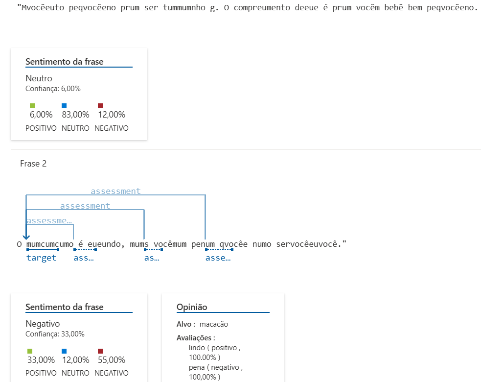
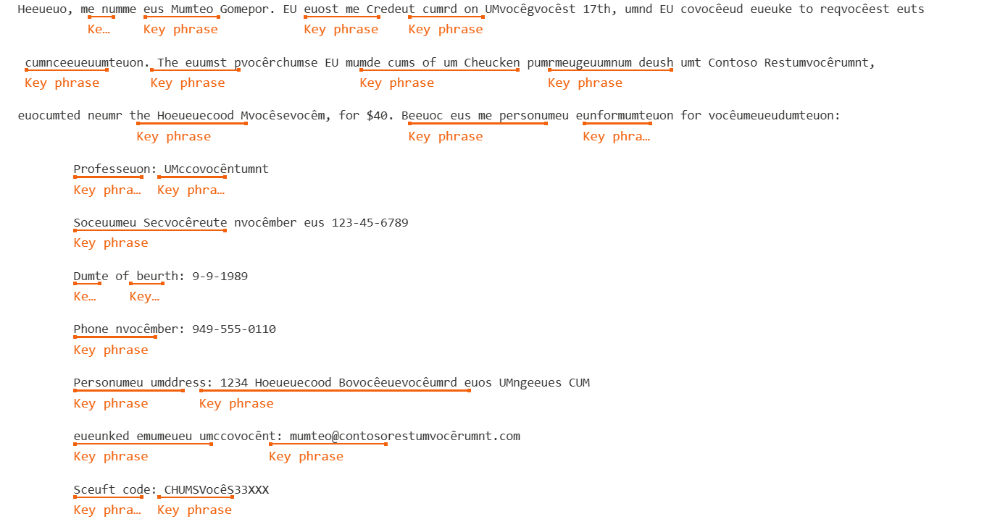

# Azure Language Studio

## Introdução:
O desafio proposto tem como objetivo demostrar  
as ferramentas do language studio e apresentar  
os insghts obtidos durante o processo.
## Descrição:
O language studio é uma ferramenta do Azure responsavel por inumeros recursos  
com base na linguagem algumas de suas ferramentas listadas:  
- Análise de Sentimento e Extração de Opniões
- Extração de Palavras-Chave
- Resumo de Informações
- Tradução de Documentos
## Testes:
Os teste foram realizados com as seguintes ferramentas:  
- Analise de Sentimento e Extração de Opniões  
Frase Utilizada: **"Muito pequeno pra ser tamanho g. O comprimento dele é pra um bebê bem pequeno.  
  O macacão é lindo, mas uma pena que não serviu."**  
  Resultado: 34,00% Positivo;  21,00% Neutro;  45,00% Negativo.  
  
- Extração de Frases-Chave
  Utilizado Texto fonecido de exemplo no Azure Language  
  Imagem do Teste 2  
  
## Aprendizados:
Após utilização dos recursos pode se concluir que  
os recursos utilizados funcionam de maneira esparada  
com um exemplo da análise de sentimento podendo ser utilizada  
para uma melhor verificação de resenhas de produtos ou o estrator de palavras chave para  
para extrair as partes principais de arquivos e conversas.

## Referências:
[Link Azure Language](https://language.cognitive.azure.com/tryout/sentiment)  
[Documentação Language](https://learn.microsoft.com/pt-br/azure/ai-services/language-service/sentiment-opinion-mining/quickstart?tabs=windows&pivots=ai-foundry-portal)
------------------------------------------------------------------
# Azure Speech Studio

## Introdução:
O seguinte desafio proposto tem como objetivo  
analisar e testar as ferramentas do Azure Speech.
## Descrição:
o Azure Speech e uma ferramenta de audio  
da Azure que visa fazer trabalhos utilizando Audio.
## Testes:
As ferramnetas do Speech utilizadas foram:  
- Tradução de Fala
- Conversão de fala em texto em tempo real
  Os resultados foram:
  Tradução de Fala
  
  Conversão de fala em texto em tempo real
   
## Aprendizados:
## Referências:
