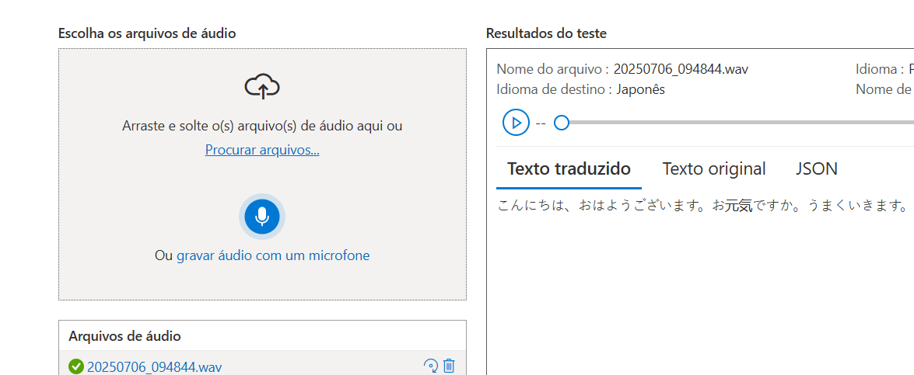
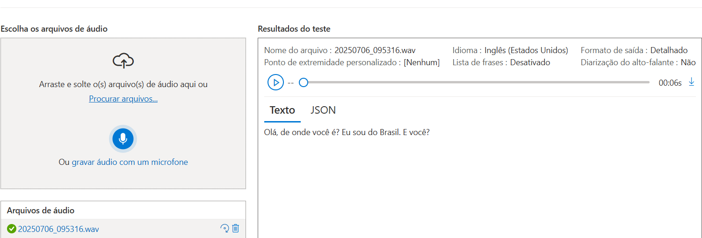

# Azure Language Studio

## Introdução:
O desafio proposto tem como objetivo demostrar  
as ferramentas do Language Studio e apresentar  
os insghts obtidos durante o processo.
## Descrição:
O Language Studio é uma ferramenta do Azure responsável por inúmeros recursos  
com base na linguagem algumas de suas ferramentas listadas:  
- Análise de Sentimento e Extração de Opniões
- Extração de Palavras-Chave
- Resumo de Informações
- Tradução de Documentos
## Testes:
Os teste foram realizados com as seguintes ferramentas:  
- Ánalise de Sentimento e Extração de Opniões  
Frase Utilizada: **"Muito pequeno pra ser tamanho g. O comprimento dele é pra um bebê bem pequeno.  
  O macacão é lindo, mas uma pena que não serviu."**  
  Resultado:  
  34,00% Positivo;  
  21,00% Neutro;  
  45,00% Negativo.
  
  
- Extração de Frases-Chave
  Utilizado Texto fornecido de exemplo no Azure Language Studio  
  Imagem do Teste 2  
  
  
## Aprendizados:
Após utilizar os recursos, foi possível concluir que eles funcionam conforme o esperado    
com um exemplo da análise de sentimento podendo ser utilizada  
para uma melhor verificação de resenhas de produtos ou o extrator de palavras chave  
para extrair as partes principais de arquivos e conversas.

## Referências:
[Link Azure Language Studio](https://language.cognitive.azure.com/tryout/sentiment)  
[Documentação Language Studio](https://learn.microsoft.com/pt-br/azure/ai-services/language-service/sentiment-opinion-mining/quickstart?tabs=windows&pivots=ai-foundry-portal)

------------------------------------------------------------------
# Azure Speech Studio

## Introdução:
O seguinte desafio proposto tem como objetivo  
analisar e testar as ferramentas do Azure Speech.
## Descrição:
O Azure Speech Studio é uma plataforma de inteligência artificial voltada  
para o processamento de voz, oferecendo recursos como transcrição,  
tradução de fala e síntese de voz.
## Testes:
As ferramnetas do Speech utilizadas foram:  
- Tradução de Fala  
- Conversão de fala em texto em tempo real
  
  Os testes acima foram utilizados usando audios gravados utilizando o  
  microfone do Speech Studio.  
  Os resultados foram:  
  Tradução de Fala  
  
  Os testes demonstraram sucesso ao converter um audio
  do portugues para o japones.
  
  Conversão de fala em texto em tempo real  
  
  O teste também demonstrou ser um grande sucesso ao captar a o audio  
  e o transcreve-lo para texto.  
  
## Aprendizados:
Ao se utilizar as ferramentas do speech acima mencionadas  
é comprovado que ambas funcionam perfeitamente conforme  
o esperado. Uma aplicação interessante é a criação de documentos por voz,  
especialmente quando a fala transmite nuances que podem se perder na   
escrita digitada. Além de romper a barreira da linguagem como é o  
caso da tradução da fala.  
## Referências:
[Link Azure Speech Studio](https://speech.microsoft.com/portal)  
[Documentação Speech Studio](https://learn.microsoft.com/pt-br/azure/ai-services/speech-service/) 
